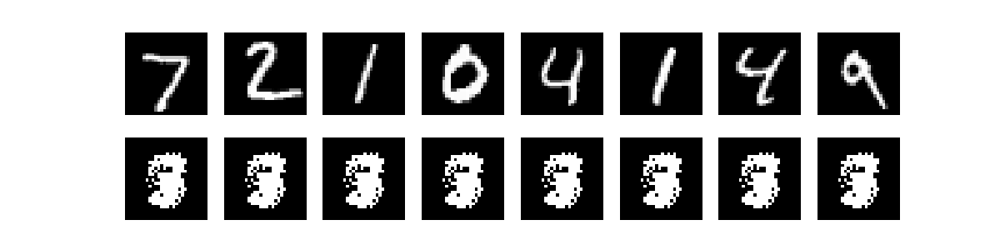
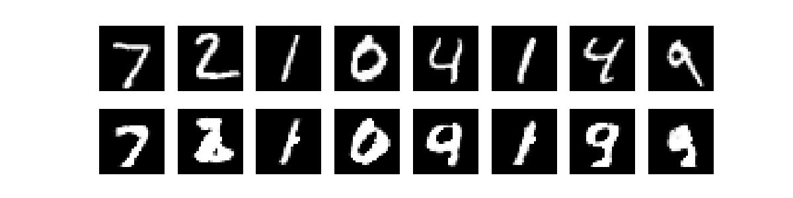
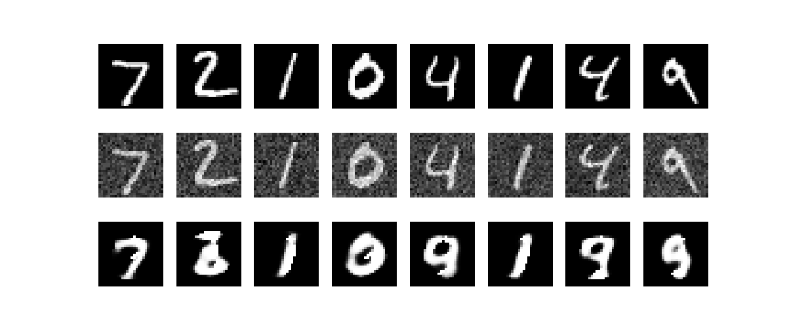
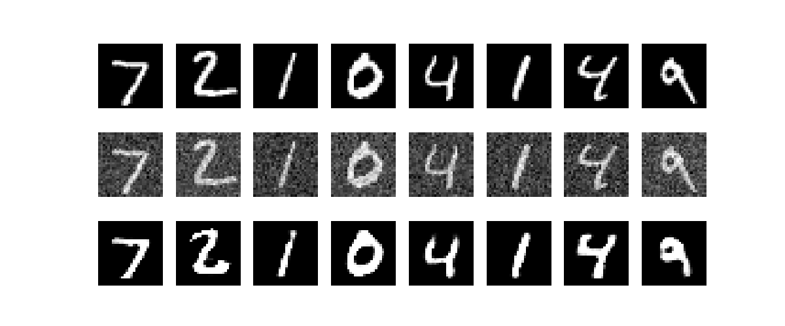

# Implementation in pytorch of Auto-Encoders: Linear, Denoising, Contractive Auto-encoders

### 1. Data Loading
MNIST dataset was loading with batch size of 64 and intermediates operations like Normalisation () 

## I. Linear Auto-Encoders
In this case of Deep linear autoencoder, when we use six hidden layers with the following linear structure inside the encoder: 28 * 28 -> 512 -> 256 -> 128 -> 64 -> 16 -> 3, the performance of the model is very poor because the size of the latent code is reduced, Network architecture is too deep Compare to the Simple Linear Autoencoder model which performs better despite its simple architecture: 28 * 28 -> 128 -> 64 -> 32 -> 16 -> 8 

**Result:** 

Deep Linear auto-encoder reconstruction of eigth MNIST images

Simple Linear auto-encoder reconstruction of eigth MNIST images

## II. Denoising Auto-Encoders
## III. Contractive Auto-Encoders
For the contractive autoencoder, we use as architecture of the encoder two fully connected layers with relu as activation function and for the decoder, we use also two layers where the first layer has relu as activation function and the second has sigmoid as activation function.
The loss function of a Contractive Autoencoder typically consists of two main components: the reconstruction loss and the contractive penalty.
It's written as follow:

$$L = MSE(x, \hat{x}) + \lambda * contractive \  penalty$$

where $$contractive \ penalty = \Big\Vert\sum_{i} \frac{\partial h_i}{\partial x}\Big\Vert_F^2$$

$\lambda$ is the hyperparameter that controls the relative importance of the contractive penalty term compared to the reconstruction loss.

We use two values of lambda two train our model: $\lambda = 5$ and $\lambda = 1e-4$.

For $\lambda = 5$, the model is very sensitive to the variations in the input data. We add a gaussian noise to the data then the model is not able to reconstruct well the data at some point.

For $\lambda = 1e-4$, our model perform well on unseen data. It's not too sensitive to the variation.

**Result:** 

Contractive auto-encoder reconstruction of eigth MNIST images for lambda = 5

Contractive auto-encoder reconstruction of eigth MNIST images for lambda = 1e-4

### Build With

**Language:** Python

**Package:** torchvision, matplotlib, Pytorch

### Run Locally
### License

[MIT](https://choosealicense.com/licenses/mit/)